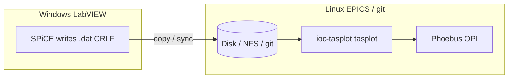

# Architecture notes — SPEC vs SPiCE (demo briefing)

Short ADRs for control-room demos and migration talks.
Detail on parsers: [`docs/DATA_FORMATS.md`](../docs/DATA_FORMATS.md).
Sample files (local, not in git): `demo/live_test.dat` (SPiCE), `demo/yongcai_20240530.spec` (SPEC).

---

## Command / header cheat sheet

| Role | CERTIF **SPEC** | ORNL **SPiCE** `.dat` (HFIR TAS) |
|------|-----------------|----------------------------------|
| File open | `#F path` | (filename + path convention) |
| Scan start | `#S n command …` | `# scan = n` |
| Human command | (on `#S` line) | `# command = scanrel s1 -4 4 .1` |
| Expanded command | — | `# builtin_command = scan s1 @(s1)+-4 …` |
| Column labels | `#L lab1  lab2  …` (two spaces) | `# col_headers =` then `#   Pt.  s1  time  detector …` |
| Column count | `#N n` | (count names on header line) |
| Default axes | often first / last col | `# def_x = s1`, `# def_y = detector` |
| Multi-scan file | many `#S` blocks in one file | usually **one scan per `.dat`** |
| Typical host | Linux / beamline SPEC | **Windows** LabVIEW **SPiCE** |

**ioc-tasplot stance:** one engine (`ScanDataset`) loads **both**; UI is Phoebus, not LabVIEW.

---

## ADR-001 — Support SPEC and SPiCE as first-class inputs

| | |
|--|--|
| **Status** | Accepted |
| **Context** | HB3 archives are SPiCE `.dat`; NSLS-II / PyMca demos use CERTIF SPEC (`demo/yongcai_*.spec`). |
| **Decision** | Parse both in `tasplot`; expose the same plot/combine/buffer PVs. |
| **Consequences** | Column naming differs (`#L` vs `# col_headers`). Tools that only speak SPEC (stock PyMca SpecFile) need a shim or native SPiCE support. |

---

## ADR-002 — SPiCE is Windows-origin; treat `^M` (CRLF) as part of the format risk

| | |
|--|--|
| **Status** | Accepted (operational hazard) |
| **Context** | SPiCE runs on **Windows**. Editors show end-of-line as `^M` (CR). Verified: HB3 `HB3_exp0382_scan0001.dat` and `demo/live_test.dat` are **CRLF**. YongCai SPEC demo is typically **LF-only**. |
| **Decision** | Parsers **must accept CRLF and LF** (strip `\r`). Do **not** assume “round-trip identity” if users re-save files in editors, Excel, or git with `core.autocrlf`. |
| **Consequences** | Byte-identical archives can become LF-only after Linux save; some legacy Windows tools may then behave oddly. Prefer **read-normalize, write-policy** (document what we emit). Diffs in git may look noisy if EOL flips. |

### ADR-002a — Unpredictable behavior when users re-save “graffiti” / SPiCE files

| | |
|--|--|
| **Status** | Accepted risk / watch |
| **Context** | “Graffiti” era text `.dat` files (and SPiCE exports) often carry CRLF. Saving under Linux, GitHub Desktop, VS Code “LF”, or NFS gateways can **strip or convert** `^M` without changing scientific content. |
| **Decision** | Treat EOL conversion as **non-semantic** for counting/plotting, but **call it out** in demos and ops docs. Avoid relying on exact file bytes for integrity checks unless hash policy ignores EOL. |
| **Migration impact** | LabVIEW/SPiCE (**Windows**) → EPICS/Phoebus (**mostly Linux**) increases how often files cross EOL cultures. Plan: tolerant parsers + clear “don’t re-save in Notepad++/Excel” guidance for raw archive copies. |

---

## ADR-003 — Peak fit: SPiCE → temp SPEC for PyMca (shim), not a second IOC

| | |
|--|--|
| **Status** | Accepted (shipped) |
| **Context** | Stock PyMca SpecFile expects `#S` / `#L`. SPiCE headers yield `Column 0…N`. |
| **Decision** | Phoebus **PyMca** button converts SPiCE → temp SPEC with named `#L`; CERTIF SPEC passes through. Longer term: optional native SPiCE in upstream PyMca. |
| **Rejected** | Embedding **ioc-pymca/pcaspy** as the primary plot server. |

---

## ADR-004 — Control-room browse/graph is Phoebus + PyDevice, not LabVIEW SpICE Data tab

| | |
|--|--|
| **Status** | Accepted (in progress → MVP) |
| **Context** | SpICE Data tab (Browse / Graph / Combine / Buffers) is the UX reference. |
| **Decision** | Replace that workflow with **ioc-tasplot** (`TAS:Plot:*` + `TASPlot.bob`). SpICE remains the **writer** of `.dat` until/unless scan control moves. |
| **Consequences** | Dual-stack period: Windows writer + Linux reader; reinforces ADR-002. |

---

## Demo talking points (2 minutes)

1. Open a SPiCE header (`# scan`, `# command`, `# col_headers`) next to a SPEC block (`#S`, `#L`).
2. Show Emacs/vi `^M` on a SPiCE file vs clean LF SPEC.
3. Load both in Phoebus; same Graph / Combine / Buffer path.
4. Mention PyMca shim: SPiCE gains named columns only after temp `#L` export.

---

## Related docs

- [`docs/DATA_FORMATS.md`](../docs/DATA_FORMATS.md) — full field tables  
- [`docs/reference/tas-plotting-tools-landscape.md`](../docs/reference/tas-plotting-tools-landscape.md) — PyMca SPiCE shim vs native  
- [`docs/reference/spice-gui/README.md`](../docs/reference/spice-gui/README.md) — SpICE GUI screenshots  
