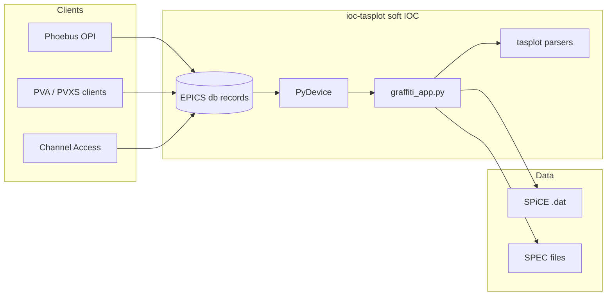

# ioc-tasplot — PyDevice IOC (PVXS / Secure EPICS)

Plotting and scan-file services for TAS should be delivered as a **standard EPICS soft IOC with PyDevice**, not as a **pcaspy** server. This matches facility direction for **PVXS** and future **Secure EPICS**, and follows the same pattern as [ioc-hkl](https://github.com/hkl-projects/ioc-hkl) (`/epics/iocs/ioc-hkl`).

## Why not pcaspy for production

| Topic | PyDevice IOC (Base + QSRV 2) | pcaspy / pcaspy_wrapper |
|-------|------------------------------|-------------------------|
| **PV model** | Normal `db` records (`ai`, `waveform`, …) | PCAS server; PVs not in IOC database |
| **PVXS / PVA** | Add `pvxs` + QSRV 2 to Makefile (same as other Base IOCs) | CA native; PVA only via wrapper or separate bridge |
| **Secure EPICS** | Supported on PVXS stack when deployed | Not on the primary migration path |
| **Autosave** | Works on record names like any soft IOC | **Not supported** for wrapper-exposed PVs (parallel namespace) |
| **Phoebus / archiver** | Standard OPI, CA/PVA clients | Custom; dual-protocol maintenance |

The [pcaspy_wrapper](https://code.ornl.gov/idac/ex/pcaspy_wrapper) (Alex Sobhani) can expose **both CA and PVA** with a one-line import change, but it still sits **outside** the IOC record database, uses **pvapy** today (pvxs port planned), lacks **arrays/limits** in early versions, and does **not** give autosave/archiver the same view as database records. BL14B/HYSPEC guidance: **PyDevice rewrite is the long-term default**; wrapper is a **time-boxed fallback** ([pcaspy-pvxs evaluation](https://github.com/hkl-projects/pcaspy-pvxs/blob/main/docs/evaluation-pcaspy-wrapper.md), [BL14B secure EPICS summary](https://github.com/hkl-projects/pcaspy-pvxs/blob/main/docs/bl14b-secure-epics-meeting-summary.md)).

**Conclusion:** Keep [pcaspy-server](https://github.com/hkl-projects/pcaspy-server) as a **prototype** only. Production HB3/TAS plotting → **`ioc-tasplot`** (this repo) using **PyDevice** + **`tasplot`** parsers.

## Reference template: ioc-hkl

| ioc-hkl piece | ioc-tasplot analogue |
|---------------|-------------------|
| `python/hkl.py`, `hklApp.py` | `python/graffiti_app.py` — scan load, axes, stats |
| `hklApp/Db/*.template` | `plotApp/Db/plot.template` — `field(DTYP,"pydev")` |
| `iocBoot/iocpydev/st_pixi.cmd` | `iocBoot/iocTasplot/st.cmd` |
| `configure/RELEASE` + `PYDEVICE` | Same; point to PyDevice install |
| Pixi / conda env | Optional; HB3 can share controls env |
| Makefile: `_DBD += pydev.dbd`, `_LIBS += pydev` | `plotApp` src Makefile |

Example PyDevice record (from ioc-hkl):

```
record(ao, "$(P)$(R)forward") {
    field(DTYP, "pydev")
    field(OUT, "@hkl_calc.forward()")
}
```

Plot waveform readback (same mechanism as ioc-hkl `detimage`):

```
record(waveform, "$(P)$(R)Xdata") {
    field(DTYP, "pydev")
    field(INP, "@graffiti_plot.xdata()")
    field(NELM, "$(MAXPTS)")
    field(FTVL, "DOUBLE")
}
```

## Architecture



- **`tasplot`** — format detection, SPiCE + SPEC parse (no EPICS dependency).
- **`graffiti_app`** — state (paths, current scan), methods called from `@...` in db.
- **`plotApp/Db`** — file selection, `Acquire`, `Xdata`/`Ydata`/`YdataErr`, column names, scan info strings.
- **QSRV 2** — add via facility `add_pvxs.py` / Makefile pattern when building for BL14B/HFIR PVXS rollout.

## PV namespace (TAS default)

Default prefix: `TAS:Plot:` (`PREFIX` in `st.cmd` / `plot.substitutions`; beamline deploy may override, e.g. `HB3:Plot:`).

| Record | Type | Role |
|--------|------|------|
| `SelectedFile` | lso | Full path (File + FileSelector); auto-loads on browse (`.$` long strings) |
| `FileNumber` | longout | Scan # spinner — rebuilds `*_scanNNNN.dat` and auto-reloads (SPiCE scroll) |
| `FullFileName_RBV` | lsi | Resolved path IOC loads (grey header; use `.$`; updates on Scan #) |
| `FileExists_RBV` | bi | Readable file |
| `Acquire` | longout | Manual reload (`Reload` button); browse/Scan # auto-load |
| `XCol`, `YCol` | lso | Plot column names (any column; replot on write) |
| `NormMode` | mbbo | None / Column / Fixed normalization |
| `NormCol` | lso | Normalization column (e.g. `monitor`, `mcu`) |
| `NormValue` | ao | Fixed divisor when `NormMode` = Fixed |
| `XCol_RBV`, `YCol_RBV` | lsi | Active X/Y after load |
| `ColHeaders_RBV` | lsi | Semicolon-separated column list (`.$`) |
| `PlotAxisLabel_RBV` | lsi | Y-axis title for Phoebus xyplot |
| `DetX_RBV`, `DetY_RBV` | stringin | File defaults (`def_x` / `def_y`) |
| `NColumns_RBV`, `NRows_RBV` | longin | Table shape |
| `Xdata`, `Ydata`, `YdataErr` | waveform | Plot arrays (Phoebus strip chart) |
| `SpecScanNumber` | longout | When file is SPEC, select `#S` scan |
| `Format_RBV` | stringin | `spice` or `spec` |

Live scan: optional `SCAN` on `Acquire` or separate `Reload` record; Python re-reads file (same as SPiCE Graph Data refresh).

## Boot / build checklist

1. Clone repo to `/epics/iocs/ioc-tasplot`.
2. Set `configure/RELEASE.local`: `EPICS_BASE`, `PYDEVICE` (e.g. `/epics/support/pydevice` or bundled copy from ioc-pymca).
3. `make` in `plotApp` and `iocBoot`.
4. `st.cmd`: `epicsEnvSet("PYTHONPATH", "$(TOP)/python:...")`, `pydev("from graffiti_app import graffiti_plot")`, `dbLoadRecords`, `iocInit`.
5. Facility step: add **pvxs** / QSRV 2 to Makefile for **PVXS** and Secure EPICS testing.
6. **Autosave**: include plot PVs (e.g. `TAS:Plot:`) in beamline `.sav` like any motor IOC.

## Relation to ioc-pymca

[ioc-pymca](https://github.com/hkl-projects/ioc-pymca) embeds **PyMca** for heavy analysis. **ioc-tasplot** is intentionally lighter: **strip-chart / Graffiti-class** plotting via **waveform PVs**, using **`tasplot`** instead of full PyMca. Both can coexist (different prefixes).

## Implementation status in this repo

| Component | Status |
|-----------|--------|
| `tasplot` parsers (SPiCE + SPEC) | Done + tests |
| `python/graffiti_app.py` | Initial engine |
| `plotApp/Db/plot.template` | Skeleton |
| `iocBoot/iocTasplot/st.cmd` | Example boot |
| Full Makefile / PyDevice submodule | Follow ioc-hkl; deploy-specific |

## References

- CERTIF SPEC format: https://certif.com/downloads/css_docs/spec_manA4.pdf  
- [hkl-projects/ioc-hkl](https://github.com/hkl-projects/ioc-hkl) — PyDevice IOC template  
- [hkl-projects/ioc-pymca](https://github.com/hkl-projects/ioc-pymca) — PyDevice + PyMca  
- EPICS PyDevice: see ioc-pymca `pycalcRecord.md` / PyDevice README  
- ORNL PVXS migration notes: `pcaspy-pvxs` docs in your tree  
