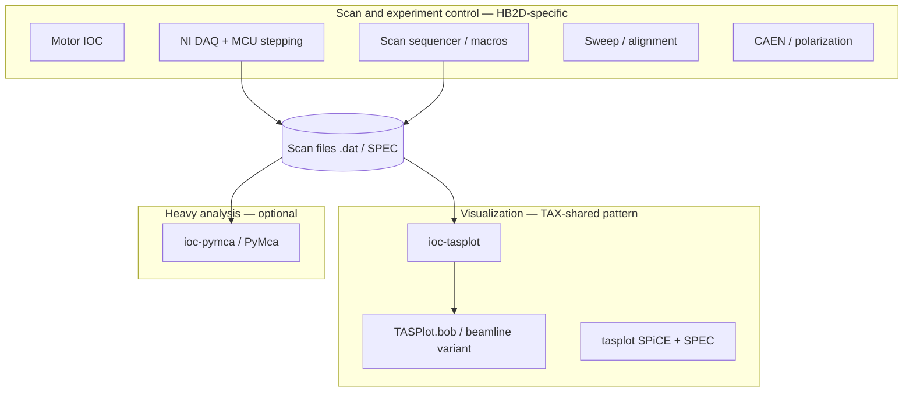

# HB2D requirements ↔ ioc-tasplot scope mapping

Maps items from [hb2d-epics-upgrade-data-handling-scan-control.md](hb2d-epics-upgrade-data-handling-scan-control.md) to what **[ioc-tasplot](https://github.com/kgofron/ioc-tasplot)** delivers today, what it can reasonably add, and what needs a **different** beamline IOC or tool.

**Audience:** HB2D EPICS upgrade discussion, TAX instrument teams, IDAC SMEs.

**Last aligned with ioc-tasplot:** 2026-06 (HB3 `TAS:Plot:` prototype, `TASPlot.bob`).

---

## What ioc-tasplot is

A **PyDevice soft IOC** that **reads completed (or growing) scan files** from disk (SPiCE `.dat`, SPEC) and exposes **plot + metadata PVs** to Phoebus. It is the SpICE **Browse Data** + **Graph Data** successor — not a scan sequencer, motor IOC, or DAQ layer.

| Layer | Typical owner for HB2D upgrade |
|-------|--------------------------------|
| Motors, step loop, MCU stepping, NI DAQ | Beamline **scan / experiment control** IOC |
| Browse files, plot X/Y, headers, reload | **ioc-tasplot** (TAX-shared pattern) |
| Peak fit, heavy analysis | **ioc-pymca**, PyMca, or offline tools |
| Storage policy (GPFS, retention) | Facility / beamline operations |

**Repo:** `ioc-tasplot` · **OPI:** `plotApp/op/bob/TASPlot.bob` · **Prefix (dev):** `TAS:Plot:`  
**SPiCE UX reference:** [spice-gui/README.md](spice-gui/README.md)

---

## Legend

| Status | Meaning |
|--------|---------|
| **Done** | Implemented and tested on HB3-style data |
| **Planned** | Natural extension in this repo (see phase notes) |
| **Partial** | Related capability exists; full HB2D intent not met |
| **Other IOC** | Requires scan control, hardware, or separate application |
| **N/A** | Policy / discovery question, not software in this repo |

---

## Visualization and Data Handling

| HB2D requirement | Status | ioc-tasplot notes |
|------------------|--------|-------------------|
| MCU-based scan control + detector capture per step | **Other IOC** | Scan orchestration; IOC only **reads** `mcu` / `monitor` columns after save |
| Integrate NI-based DAQ | **Other IOC** | Hardware drivers and acquisition |
| Macro/stack interface (edit/run scans, Python) | **Other IOC** | This IOC is Python/PyDevice but does **not** execute scan macros; consumes scan **output files** |
| Graph results, peak/waveform detection, automated fitting, reuse prior peak positions | **Planned** | Phase 6 in spice-gui map; or delegate to **ioc-pymca** |
| SpICE Graph Data–like functionality | **Done** | `TASPlot.bob` — browse, xyplot, column pickers |
| Plot **historical** data | **Done** | `SelectedFile`, `FileNumber`, `tasplot` loaders |
| Plot **real-time** data | **Partial** | **Reload** + 1 s waveform SCAN on `Xdata`/`Ydata`; not step-synced live acquisition |
| Choose scan number, X & Y axes | **Done** | `FileNumber`, `SpecScanNumber`, `XCol`, `YCol` |
| Tilting-angle scan (Larmor) | **Planned** | Plot any column once data is in SPiCE format; no Larmor-specific logic yet |
| Two-flipper measurements calculator | **Other IOC** | Dedicated analysis tool |
| ILL quick calculators | **Other IOC** | External calculators / separate OPI |

### Related capabilities (not explicit in HB2D list)

| Capability | Status | PVs / UI |
|------------|--------|----------|
| Data file text panel (SpICE DataFileContents) | **Done** | `DataFileText` (I/O Intr; full file up to 64 KB) |
| Column header list | **Done** | `ColHeaders_RBV` |
| SPiCE vs SPEC detection | **Done** | `Format_RBV` |
| Load errors, file presence | **Done** | `LastError_RBV`, `FileExists_RBV` |
| Poisson Y errors | **Done** | `YdataErr` |
| Long file paths in Phoebus | **Done** | `lsi`/`lso` + `.$` suffix |
| Normalization (e.g. to monitor / MCU) | **Done** | `NormMode`, `NormCol`, `NormValue` |

---

## Scan and Experiment Control

| HB2D requirement | Status | ioc-tasplot notes |
|------------------|--------|-------------------|
| Move motors → confirm position → acquire (per step) | **Other IOC** | Motor + scan sequencer |
| Step scans based on MCU (not time) | **Other IOC** | Defines how data is **taken**; plot IOC can **display** MCU/monitor columns |
| Modify scan parameters dynamically during run | **Other IOC** | Live scan engine |
| Plot arbitrary parameters while scanning | **Partial** | **Planned:** file watch / auto-reload on growing `.dat`; plots columns from file, not live motor handshake |
| Estimate scan time | **Other IOC** | Sequencer / scan definition |
| Error detection (motor limits, scan grammar) | **Other IOC** | Live scan validation; plot IOC only reports **file load** errors |
| Sweep function (fast alignment vs rotation angle) | **Other IOC** | Real-time sweep + motor control |
| Polarization + CAEN supplies (`B = value / wavelength`) | **Other IOC** | Hardware / power-supply IOC |

---

## IDAC SME questions — how ioc-tasplot informs answers

These are **discovery** questions for the beamline. ioc-tasplot does not set policy; it illustrates one TAX/HB3 analysis path.

### Data handling

| Question | TAS / ioc-tasplot perspective |
|----------|-------------------------------|
| What do you do with data after acquisition? | SPiCE `.dat` (or SPEC) on User tree; **ioc-tasplot** loads for interactive plot + header view in Phoebus |
| Storage / export format? | Reads native SPiCE/SPEC; export not in scope (archiver / offline tools) |
| Analysis tools needed? | Strip charts in Phoebus now; normalization and peak fit planned; heavy work → **PyMca** |
| Historical access / GPFS vs local? | **N/A** — IOC reads any path clients browse to (`SelectedFile`); retention is ops decision |
| Local retention volume? | **N/A** |

### Scan

| Question | TAS / ioc-tasplot perspective |
|----------|-------------------------------|
| Smallest step resolution? | **N/A** — defined by scan IOC and motors, not plot IOC |
| Typical step duration? | **N/A** — same |

---

## Suggested HB2D upgrade split

**Talking point for TAX meeting:** Reuse **ioc-tasplot** + **tasplot** parsers across TAX beamlines (HB2, HB3, …) with prefix/OPI macros per instrument; keep **scan execution and hardware** on each beamline’s control stack.

---

## Roadmap in this repo (HB2D-relevant items)

| Phase | HB2D-related deliverable | Reference |
|-------|--------------------------|-----------|
| **v1 (done)** | Browse, Graph Data, Scan #, X/Y columns, DataFileContents | `TASPlot.bob`, `STATUS.md` |
| **Phase 2 (done)** | Normalization (`mcu`, `monitor`, fixed value) | spice-gui BrowseData-norm |
| **Live reload** | Plot while scan file grows | STATUS “Next” |
| **Phase 4–5** | Log scales, combine scans, overlays | spice-gui README |
| **Phase 6** | Peak / Gaussian fit | spice-gui GraphData-peak-fit |
| **Facility** | PVXS / QSRV 2 | `PYDEVICE_IOC.md` |

---

## References

- [HB2D requirements brief](hb2d-epics-upgrade-data-handling-scan-control.md)
- [SPiCE GUI phase map](spice-gui/README.md)
- [PyDevice IOC architecture](../PYDEVICE_IOC.md)
- [Session status / PV list](../STATUS.md)
