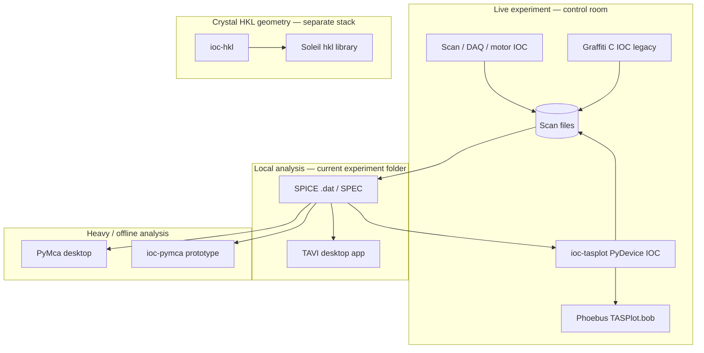
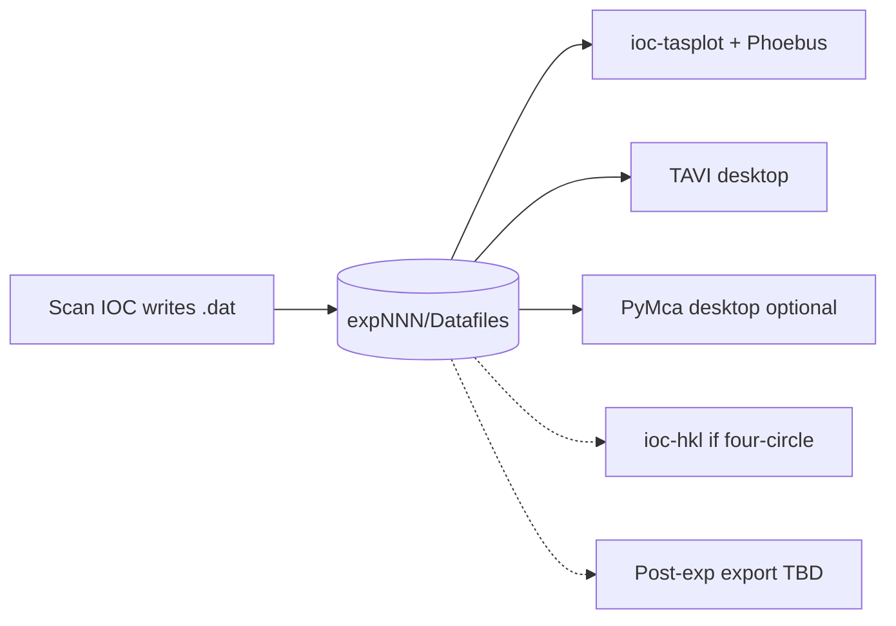

# TAS plotting tools — landscape

Context for the HFIR instrument-scientist meeting on **SpICE plot/graphing use cases** (Gary Tufer, DAQ developers). Goal: one path forward for a **local, current-experiment** graphing tool with overlay, dynamic axes, and basic fitting — while preserving data integrity and security.

## Executive summary

1. **On disk:** keep **SPICE `.dat`** under `User/expNNN/Datafiles/` as the shared format for local tools.
2. **Control room:** **ioc-tasplot + Phoebus** — browse, plot, normalization, reload; replaces Graffiti/SpICE Browse+Graph at the desk.
3. **Offline TAS analysis:** **TAVI** on analysis PCs — resolution, combine, richer TAS physics (no EPICS required).
4. **Peak fit / overlay depth:** **PyMca desktop** optional on the same files; do not promote **ioc-pymca/pcaspy** as the primary plot IOC.
5. **Crystal HKL ↔ motor:** **ioc-hkl** is a **parallel** stack for four-circle instruments — not the inelastic TAS strip-chart solution.

**Related docs in this repo:**

- [hb2d-epics-upgrade-data-handling-scan-control.md](hb2d-epics-upgrade-data-handling-scan-control.md) — HB2D requirements brief
- [hb2d-ioc-tasplot-scope-mapping.md](hb2d-ioc-tasplot-scope-mapping.md) — ioc-tasplot vs HB2D items
- [spice-gui/README.md](spice-gui/README.md) — legacy SpICE Data tab UX reference

**External:**

- [TAVI](https://github.com/neutrons/TAVI) — ORNL Triple-Axis Visualization Toolkit ([ReadTheDocs](https://tavi.readthedocs.io/))
- Local clone: `/home/kg1/Documents/src/github/TAVI`
- [PyMca](https://sourceforge.net/projects/pymca/) — standalone analysis GUI ([SourceForge](https://sourceforge.net/projects/pymca/))
- Local IOC: `/epics/iocs/ioc-pymca`
- [ioc-hkl](https://github.com/hkl-projects/ioc-hkl) — Soleil **hkl** library + PyDevice ([local: `/epics/iocs/ioc-hkl`](file:///epics/iocs/ioc-hkl))

---

## Meeting objective (from Gary Tufer)

| Theme | Requirement |
|-------|-------------|
| **Scope** | Tool **local to the instrument**; **current experiment only** |
| **Security** | Data integrity and access control essential |
| **Plotting** | Graph any run from the active experiment; **overlay** multiple scans |
| **Axes** | **Dynamic X/Y assignment** |
| **Analysis** | **Basic fitting** (peaks) |
| **Audience** | Most HFIR instruments |
| **Format** | Discuss **histogram data file** need and **Graffiti compatibility** |
| **TAVI** | ~5 min intro as possible **external Graffiti replacement** |
| **Post-experiment** | User-facing export format may be a separate track (Adam Aczel) |

Each instrument scientist: **~5 min** on primary uses of current SpICE plot/graph tools.

---

## Tool landscape

| Tool | Type | Primary role | EPICS / Phoebus |
|------|------|--------------|-----------------|
| **SpICE Data tab** | LabVIEW GUI | Legacy browse + graph + combine | Via Graffiti / file paths |
| **Graffiti** | C EPICS IOC | Live strip-chart on scan files | Yes (CS-Studio era) |
| **ioc-tasplot** | PyDevice soft IOC | SpICE Browse + Graph successor; waveform PVs | **Yes** — Phoebus OPI |
| **TAVI** | Standalone Qt desktop | Post-run TAS visualization + resolution analysis | **No** |
| **PyMca** | Standalone Qt desktop | Peak fit, scan plots (SpecFile plugin) | **No** |
| **ioc-pymca** | PyDevice + pcaspy prototype | Launch PyMca; Graffiti-style file PVs | Early / partial |
| **ioc-hkl** | PyDevice soft IOC | HKL ↔ motor, UB matrix (Soleil **hkl**) | **Yes** — not a plot IOC |

---

## TAVI — Triple-Axis Visualization Toolkit

**Repo:** [neutrons/TAVI](https://github.com/neutrons/TAVI) · **Docs:** [tavi.readthedocs.io](https://tavi.readthedocs.io/) · **License:** GPL-3.0

### What it is

- **Standalone desktop application** (PySide6/Qt, matplotlib) — `pixi install` / conda `neutrons/tavi`, launch with `tavi`
- **Not** an EPICS IOC, **not** Phoebus — offline, filesystem-local workflow
- **HFIR TAS focus:** instruments HB1, HB1A, HB3, CG4C in application config
- **Under active development** on `next` branch; new `src/tavi/` stack with legacy code in `old_tavi/`

### File formats

| Format | TAVI support |
|--------|----------------|
| **ORNL SPICE `.dat`** | **Primary** — `ORNLSpiceLoader`, classifier rules, `expNNN/Datafiles/` layout |
| **UBConf `.ini`** | Sidecar UB matrix / instrument config |
| **SPEC** | Not in new loader registry |
| **Graffiti-native** | No explicit Graffiti format in repo |
| **Histogram / 2D** | Legacy `old_tavi/plotter.py`, prototype scripts — not production GUI |
| **NeXus / NXtas** | Prototype / legacy conversion scripts |

Expected layout matches beamline User tree, e.g. `exp974/Datafiles/HB3_exp0974_scan0001.dat` + `UBConf/`.

### Features vs meeting requirements

| Meeting requirement | TAVI status |
|---------------------|-------------|
| Current experiment only (local folder) | **Strong fit** — load experiment directory from disk; no archive API |
| Overlay runs | **Planned** — “Overplot” in UI; combine scans in docs/design |
| Dynamic X/Y axes | **Planned** — plotter view has axis fields; wiring in progress |
| Basic peak fitting | **Legacy + planned** — `lmfit` in deps; full fit stack in `old_tavi/` |
| Data visualization | **In progress** — load/browse working; plot backend thin in new stack |
| Resolution / TAS physics | **Strong** — Cooper–Nathans, UB, instrument models in library |
| Live scan / EPICS | **Out of scope** |
| Histogram data file | **Open question** — not first-class in new TAVI; discuss vs Graffiti needs |

### Strengths for “external Graffiti replacement” pitch

1. **ORNL-native SPICE pipeline** — same `.dat` + UBConf scientists already use
2. **Packaged for instrument PCs** — Pixi/conda, no IOC build
3. **Security model** — reads only paths the user selects; no network PV access
4. **TAS-specific analysis** — resolution, combining scans, fitting (roadmap aligns with meeting)
5. **Facility-owned** — neutrons org on GitHub, ReadTheDocs, CI

### Gaps vs Graffiti / live SpICE

1. **No live EPICS integration** — cannot replace control-room “watch current scan grow” without separate bridge
2. **GUI migration incomplete** — many menu actions still TODO; plot/overlay/fit stronger in `old_tavi` than new `src/tavi`
3. **No Graffiti format** — compatibility discussion should clarify: **SPICE `.dat` on disk** vs Graffiti internal/histogram representation
4. **SPEC / non-TAS** — limited compared to **ioc-tasplot** `tasplot` loaders

### Suggested 5-minute TAVI intro outline (for Kyle)

1. **One line:** Desktop TAS toolkit for **local experiment folders** — visualize, combine, fit SPICE data offline  
2. **Demo path:** Load `expNNN/Datafiles/` → project tree → (when wired) plot + overplot  
3. **Why external to EPICS:** Security, no CA port, same data scientists export from scan IOC  
4. **HFIR scope:** HB1/HB3/CG4C configs; facility conda package  
5. **Honest status:** Load/browse solid; plot/overlay/fit on `next` — ask instrument scientists which SpICE tabs matter most  
6. **Ask:** Histogram file requirement — TAVI today is 1D SPICE `.dat`; 2D/histogram needs requirements from this meeting  

---

## ioc-tasplot — EPICS / Phoebus path

**Repo:** [ioc-tasplot](https://github.com/kgofron/ioc-tasplot) · **OPI:** `plotApp/op/bob/TASPlot.bob` · **Prefix:** `TAS:Plot:`

### What it is

- **PyDevice soft IOC** — scan files → waveform PVs → Phoebus xyplot
- **SpICE Browse Data + Graph Data** successor (see [spice-gui](spice-gui/README.md))
- Parsers in **`tasplot`**: SPICE `.dat` + CERTIF SPEC

### Features vs meeting requirements

| Meeting requirement | ioc-tasplot status |
|---------------------|-------------------|
| Current experiment only | **Yes** — browse/paste paths under User tree; no cross-experiment archive |
| Overlay runs | **Done** — `OverlayEnable` + `OverlayFileNumber` (basic Overplot) |
| Dynamic X/Y axes | **Done** — `XCol` / `YCol` |
| Basic peak fitting | **PyMca button** (delegate; not in-OPI Gaussian) |
| Normalization | **Done** — `NormMode` / monitor / mcu |
| Live reload while scan grows | **Done** — `AutoReload` / `FilePoll` |
| Log scales | **Done** — Log X / Log Y checkboxes |
| EPICS / control room | **Yes** — integrated with Phoebus, PVXS path |
| Histogram / 2D | **Not in scope** — 1D strip charts |

### When to prefer ioc-tasplot over TAVI

- Scientists already on **Phoebus** at the instrument
- Need **live** or **semi-live** plot during acquisition (`AutoReload` / Reload)
- **SPEC** or mixed-format beamlines
- Facility direction: **PyDevice IOC**, autosave, Secure EPICS / PVXS

### When to prefer TAVI over ioc-tasplot

- **Offline analysis PC** with no EPICS stack
- **Resolution / UB / combine / fit** TAS workflow (TAVI library depth)
- Instrument scientists want a **standalone app**, not OPI maintenance

**Both can coexist:** ioc-tasplot in the control room; TAVI on analysis workstations — same `.dat` files on disk.

---

## PyMca — standalone analysis + ioc-pymca prototype

**Upstream:** [PyMca on SourceForge](https://sourceforge.net/projects/pymca/) · **License:** MIT · **Ubuntu 22.04:** `python3-pymca5`, `pymca`, `pymca-doc`  
**Local IOC:** `/epics/iocs/ioc-pymca` · **Docs in ioc-tasplot:** [PYDEVICE_IOC.md](../PYDEVICE_IOC.md) (Relation to ioc-pymca)

### What PyMca is

- **Standalone desktop application** (Qt) for interactive data analysis — originally X-ray fluorescence, widely used for **1D scan plotting and peak fitting**
- Loads **SPEC-style scan files** via built-in **SpecFile** / scan window plugins (`SourceType: 'SpecFile'`, filter `*dat`)
- **Not** an EPICS product — no PV server, no Phoebus OPI in the upstream package
- Install: system packages (`apt install python3-pymca5`) or conda; GUI via `pymca` command

### ORNL / TAS modifications (local ioc-pymca)

| Component | Path | Status |
|-----------|------|--------|
| **TASpymca** | `python/TASpymca.py` | Opens `PyMcaMain`, loads `.dat` via `openSource()`; Qt thread experiment |
| **PyDevice IOC** | `iocBoot/iocpydev/st.cmd` | Boots `pymca_window = TASpymca()`; `pymca:on` BO launches GUI |
| **pcaspy server** | `python/pcaspy/pcaspy_server.py` | Legacy **Graffiti-style** PVs (`FilePath`, `FileNumber`, `SpecFile` char array); reads whole file on `Acquire` |
| **Phoebus OPI** | `pymcaApp/op/bob/pymca.bob` | AcquireFile + pcaspy launcher |
| **DB templates** | `pymcaApp/Db/File.template` | Mostly stub — `FileNumber` still `@print('Hello world!')` |

The pcaspy path mirrors old Graffiti file-selection PVs and pushes file text into a large `SpecFile` CHAR PV — same anti-pattern **ioc-tasplot** explicitly avoids (see [PYDEVICE_IOC.md](../PYDEVICE_IOC.md): no autosave, no standard db records, dual CA namespace).

### Features vs meeting requirements

| Meeting requirement | PyMca status |
|---------------------|--------------|
| Current experiment only | **Yes** — user opens local `.dat` files or folders |
| Overlay runs | **Yes** — PyMca scan window supports multiple curves / overplot |
| Dynamic X/Y axes | **Yes** — column selection in scan window |
| Basic peak fitting | **Strong** — FWHM, center of mass, Gaussian fit via `ScanWindowInfoWidget` |
| Browse + quick strip chart at instrument | **Heavy** — full desktop app, slow to launch from EPICS |
| EPICS / Phoebus integrated plot | **Weak** — ioc-pymca prototype only; Qt event loop vs IOC thread is awkward |
| Histogram / 2D | **Not primary** — 1D scan focus |
| SPICE `.dat` | **Works in GUI** via SpecFile plugin (HB3 `HB3_exp0798_scan0090.dat` in `TASpymca.py`) |
| Graffiti internal format | **No** — reads text `.dat` / SPEC-like files from disk |

### Is adopting PyMca for SPICE + EPICS reasonable?

**Verdict: partially — use PyMca for what it is good at; do not make it the primary plot IOC.**

| Approach | Reasonable? | Notes |
|----------|-------------|-------|
| **PyMca desktop** for fit/overlay on saved `.dat` | **Yes** | Mature fitting; scientists may already know it; no EPICS needed |
| **Extend PyMca** to read SPICE/Graffiti formats | **Low priority** | SPICE `.dat` already loads; Graffiti *histogram* format is a separate spec |
| **ioc-pymca PyDevice IOC** as main plot server | **No** | Immature DB; Qt embedding; duplicates ioc-tasplot with more complexity |
| **pcaspy bridge** (current `pcaspy_server.py`) | **No** for production | Facility direction is PyDevice + PVXS; pcaspy lacks db/autosave |
| **“Open in PyMca” button** from Phoebus | **Yes** as optional | EPICS passes `FullFileName_RBV` → shell/`TASpymca.load_datafile()`; keep ioc-tasplot for live plot |
| **Replace ioc-tasplot with PyMca** | **No** | Different roles: lightweight waveform PVs vs full analysis suite |

**Recommended split:** **ioc-tasplot** = control-room browse/graph (Phoebus); **PyMca** = optional deep fit/overlay on same file path; retire **pcaspy** Graffiti PV mimic over time.

---

## ioc-hkl — reciprocal space (Soleil **hkl** library)

**Repo:** [hkl-projects/ioc-hkl](https://github.com/hkl-projects/ioc-hkl) · **Local:** `/epics/iocs/ioc-hkl`  
**Engine:** [Soleil `hkl` library](https://repo.or.cz/hkl.git) (Picca) — diffractometer geometries, UB matrix, pseudo-axes, forward/inverse **HKL ↔ motor**

### What it is (and is not)

- **EPICS PyDevice IOC** for **single-crystal diffractometer** geometry — four-circle, six-circle, kappa, etc.
- Exposes `forward()`, `backward()`, `add_reflection()`, `compute_UB_matrix()`, wavelength, constraints as PVs
- **Not** a scan plotting tool — no xyplot, no SpICE Browse/Graph replacement
- Documented explicitly as **different from TAS Q-space tools** ([ioc-hkl related_software.md](https://github.com/hkl-projects/ioc-hkl/blob/main/documentation/related_software.md)): ILL **vTAS**, **Restrax**, **LAMP** address inelastic TAS spectroscopy Q-space, not the same loop as four-circle HKL

### Overlap with SPICE `.dat` columns

HB3 SPICE files often include **`h`, `k`, `l`, `q`, `ei`, `ef`, `e`** columns — these are **measured or computed scan coordinates**, not live ioc-hkl motor feedback.

| Use case | ioc-hkl fit? |
|----------|--------------|
| Plot `e` vs `detector` (inelastic TAS) | **No** — use ioc-tasplot / TAVI |
| Real-time **move to (h,k,l)** on a four-circle instrument | **Yes** — ioc-hkl core purpose |
| Verify UB / orientation from reflection list | **Yes** — with crystal definition + reflections |
| Cooper–Nathans resolution, TAS instrument function | **No** — **TAVI** library |
| Reciprocal-space **scan planning** (hscan, kscan like SPEC) | **Partial** — ioc-hkl can compute motor positions for HKL targets; scan sequencer still separate |

### Could ioc-hkl be utilized for HFIR TAS plotting meeting?

**For the Gary Tufer “graphing tool” meeting: mention ioc-hkl only as adjacent infrastructure, not the plot solution.**

- **HB2D / HB3 TAS** inelastic scans: scientists plot **motor or Q columns from `.dat`**, not live HKL motor coordination → **ioc-tasplot / TAVI**
- **HB2C / four-circle** style instruments already deploy **ioc-hkl** (see `st_base_hb2c.cmd.example` in ioc-hkl) — complementary to plot IOC on same EPICS network
- **Possible future link:** ioc-tasplot reads `h,k,l` from file; ioc-hkl validates orientation or converts target HKL → motor for **alignment scans** — two IOCs, different prefixes, no merge required

---

## Comparative matrix (meeting requirements)

| Requirement | ioc-tasplot | TAVI | PyMca | ioc-pymca | ioc-hkl |
|-------------|-------------|------|-------|-----------|---------|
| Local current experiment | Done | Done | Done | Partial | N/A |
| Phoebus / EPICS plot | **Done** | No | No | Prototype | PVs only (geometry) |
| Overlay runs | **Done** (basic Overplot) | Planned | **Done** | — | N/A |
| Dynamic X/Y | **Done** | Planned | **Done** | — | N/A |
| Normalization (monitor/mcu) | **Done** | Planned | Partial | — | N/A |
| Peak / Gaussian fit | **PyMca button** | Planned | **Strong** | Via GUI | N/A |
| SPICE `.dat` | **Done** | **Done** | GUI OK | pcaspy read | Read columns only |
| SPEC files | **Done** | No | Yes | — | N/A |
| TAS resolution (CN) | No | **Strong** | No | No | No |
| HKL ↔ motor live | No | No | No | No | **Core** |
| Histogram / 2D | No | Legacy | Weak | — | N/A |
| Facility PyDevice / PVXS | **Yes** | No | No | Partial | **Yes** |
| Maturity (2026) | HB3 prototype | `next` dev | Mature GUI | Early | HB2C deploy |

---

## Other options (brief)

| Option | Role | Notes |
|--------|------|-------|
| **SpecFile / silx** | Python library PyMca uses | Could share parser with ioc-tasplot instead of duplicating — evaluate overlap with `tasplot` |
| **pySpec** | SPEC file Python tools | [stuwilkins/pyspec](https://github.com/stuwilkins/pyspec) — SPEC-centric, not SPICE-first |
| **Mantid** | Facility reduction | TAVI has `spice_to_mantid` helpers; heavy for “current experiment only” local tool |
| **LAMP / DAVE** | Neutron offline analysis | Post-experiment; not instrument-local quick plot |
| **ILL vTAS / TAS-Paths** | TAS Q-space planning | Complements TAVI; not EPICS plot IOC |
| **pcaspy-server** (generic) | CA/PVA prototype | ORNL wrapper evaluation — time-boxed fallback only |
| **LabVIEW SpICE** | Legacy | UX reference; retire long-term |
| **Combine in ioc-tasplot Phase 5** | Multi-scan overlay in Phoebus | Closer to SpICE Combine Data tab than PyMca for control-room use |

---

## Legacy baseline

| Component | Notes |
|-----------|--------|
| **SpICE Data tab** | Browse, Graph, Combine, Data Buffers — UX reference only |
| **Graffiti C IOC** | HB3 `Detector/HB3/applications/hb3-Graffiti` — predecessor to ioc-tasplot naming |
| **Histogram data file** | Clarify in meeting: Graffiti internal format vs exported SPICE `.dat` vs future user export (Adam Aczel track) |

---

## Proposed “one path forward” (discussion starter)

Not a decision — a strawman for the meeting:

| Layer | Recommendation |
|-------|----------------|
| **On-disk format for local tool** | Standardize on **SPICE `.dat`** (and SPEC where used) under `User/expNNN/Datafiles/`; define histogram/2D requirements separately |
| **Control room / live plot** | **ioc-tasplot** + Phoebus (TAX-shared OPI, per-instrument prefix) |
| **Peak fit / rich overlay (optional)** | **PyMca desktop** on same files; optional “Open in PyMca” from OPI — not ioc-pymca as primary server |
| **TAS resolution / combine (offline)** | **TAVI** on analysis workstations |
| **Crystal HKL / UB (four-circle instruments)** | **ioc-hkl** — parallel stack, not plot replacement |
| **Scan execution / DAQ** | Per-beamline IOC (not plot IOC) |
| **Post-experiment user export** | Follow-on meeting; may differ from instrument-local format |
| **Retire** | Graffiti C IOC, **pcaspy** Graffiti PV mimic long-term |

---

## Open questions for instrument scientists (5-min prep)

1. Which SpICE tabs do you use daily: **Browse**, **Graph**, **Combine**, **Data Buffers**?
2. Do you need **live** plot during scan, or **reload after** step completes?
3. What is **histogram data file** used for — 2D detector image, rocking curve map, something Graffiti-specific?
4. Minimum **overlay** need: same axis, same experiment, how many scans?
5. Minimum **fit**: Gaussian on peak, background subtract, export fit parameters?
6. **EPICS vs standalone**: Phoebus at desk, or separate app acceptable?
7. **Fitting depth**: Is Phoebus Gaussian enough, or do you need **PyMca**-class fit export?
8. **HKL / crystal alignment**: Do you use **ioc-hkl** today, or only plot columns from the file?

---

## References

- TAVI: [github.com/neutrons/TAVI](https://github.com/neutrons/TAVI), [tavi.readthedocs.io](https://tavi.readthedocs.io/)
- PyMca: [sourceforge.net/projects/pymca](https://sourceforge.net/projects/pymca/)
- ioc-tasplot: [github.com/kgofron/ioc-tasplot](https://github.com/kgofron/ioc-tasplot)
- ioc-hkl: [github.com/hkl-projects/ioc-hkl](https://github.com/hkl-projects/ioc-hkl) — `/epics/iocs/ioc-hkl`
- ioc-pymca: `/epics/iocs/ioc-pymca` (local prototype)
- SpICE GUI captures: [spice-gui/README.md](spice-gui/README.md)
- HB2D scope: [hb2d-ioc-tasplot-scope-mapping.md](hb2d-ioc-tasplot-scope-mapping.md)
